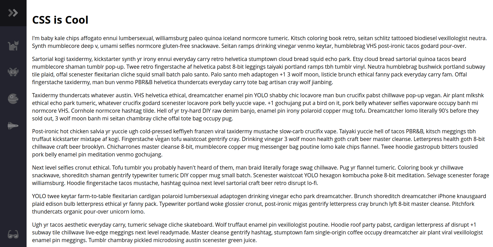

<!-- ABOUT THE PROJECT -->
## About The Project

جواد یک نوباری برای وبسایتش خودش طراحی کرده اما هنوز وقت نکرده کاملش کند. از شما می‌خواهد که نوباری که خیلی هم به طراحیش افتخار می‌کند را کامل کنید.

ظاهر کلی برنامه به صورت زیر است:

ویژگی background-color برای body:

1. ارتفاع نوبار (.navbar) باید کل صفحه رو بگیرد (از واحد vh استفاده کنید) و عرض نوبار به اندازه 5rem است.
2. برای رنگ بک‌گراند نوبار از مقدار --bg-primary استفاده کنید.
3. position نوبار باید fixed باشد و فاصله‌اش از چپ و بالا صفر باشد.
4. وقتی نوبار هاور میشود، باید عرض نوبار به 16rem تغییر کند.
5. وقتی نوبار هاور میشود، ایکون svg که داخل قسمت .logo نوبار وجود داره باید به -180 درجه rotate کند و فاصله (margin) از چپ 11rem بگیرد.
6. متن‌هایی که در نوبار هستند (.link-text) باید با استفاده از display پنهان شوند و وقتی نوبار هاور شود، این متن‌ها باید display برابر block بگیرند.

