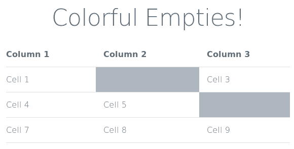

## ---خواسته های مسئله

در این سوال قصد داریم خانه‌های خالی بدنه‌ی یک جدول را رنگ کنیم. برای مثال در جدول زیر مشاهده می‌کنیم که خانه‌های خالی به رنگ خاصی در آمده‌اند:

## ---خروجی خواسته شده

جدول مورد نظر در فایل colorful_empties.html داده‌ شده است. شما باید با تکمیل فایل style.css، ویژگی گفته‌شده را به جدول اضافه کنید.

