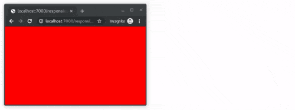

## ---درباره مسئله
در این سوال قصد داریم یک صفحه‌ی پاسخگو‌ طراحی کنیم. با تغییر اندازه‌ی عرض این صفحه، رنگ پس زمینه‌ی آن تغییر می‌کند. صفحه‌ی مورد نظر به شکل زیر خواهد بود:

## ---ویژگی background-color برای body:

1. در صورتی که عرض صفحه کمتر از ۶۰۰ پیکسل است،‌ باید (`#F00`) باشد.
2. در صورتی که عرض صفحه بین ۶۰۰ تا ۹۰۰ پیکسل (شامل خود ۶۰۰ و ۹۰۰) است، باید (`#FF0`) باشد.
3. در صورتی که عرض صفحه بیشتر از ۹۰۰ پیکسل است، باید(`#0F0`) باشد.

